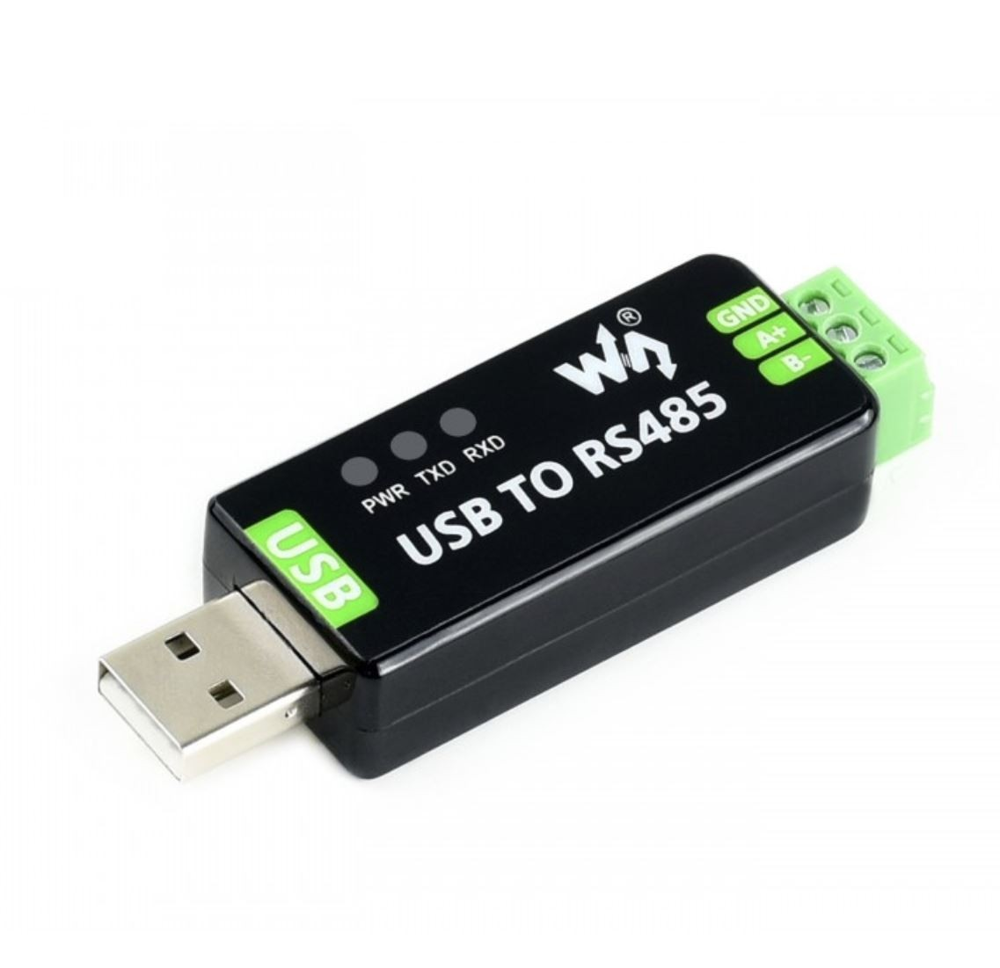

# Ligações para método direto

Dos pinos Nº 5 `(A+)` e Nº 3 `(B-)` existentes na porta HAN, deverão ser ligados os seus correspondentes no chicote, instalado pela EDP Distribuição S.A., aos respectivos terminais `A+` e `B-` do conversor TTL vs RS-485.

> 

Entre os terminais `A+` e `B-` do conversor TTL vs RS-485, *poderá* eventualmente ser instalada em paralelo uma resistência de 120 Ohm. [Mais info aqui](../EDP%20Box#impedância-de-linha).

A disponibilidade de alimentação a partir da porta HAN está limitada a uma intensidade de corrente máxima de 150 mA. **Recomenda-se não usar a porta HAN para alimentação de qualquer dispositivo.**

A ficha USB do conversor TTL vs RS-485 deverá ser ligada numa porta USB disponível no hardware utilizado para executar o Home Assistant Core. Devido à eventual localização do contador inteligente face à do hardware do Home Assistant Core, é recomendável, se possível, a utilização de uma extensão USB.

Existe a possibilidade de estender em dezenas de metros o chicote exterior, através de cabo UTP-5. Esse método não faz parte de esta prova de conceito.

**Deverá acautelar todos os requisitos e condições para este tipo de aplicação, segundo o documento fornecido pela `EDP Distribuição S.A.`, vide `Módulos alimentados pela porta HAN`, [aqui](https://www.edpdistribuicao.pt/sites/edd/files/2019-06/Requisitos%20dos%20m%C3%B3dulos%20HAN_2019.05.31.pdf).**

## Mais info

[Home Assitant Core e a sua configuração - Para método direto](./README.md#método-direto)

[Voltar](../README.md)

