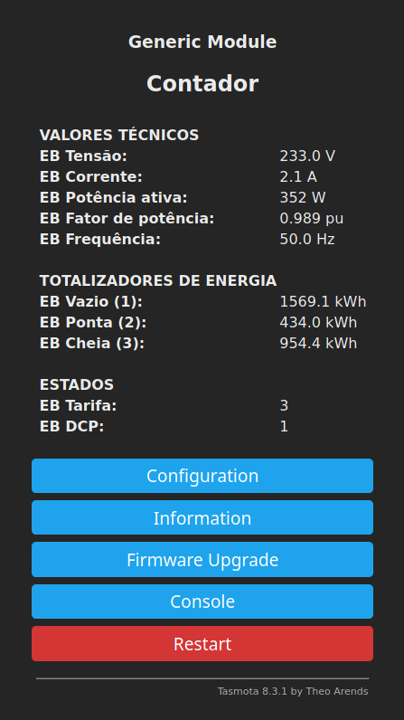

# Configuração do script para Smart Meter Interface (SMI)

Após abrir o web-gui do Tasmota, pelo seu IP local, deverá aceder à página de "Configuração" e "Editar Script".

Deverá ativar a opção de "script ativado" e colar o seguinte script:

```
>D 

>B
=>sensor53 r

>M 1

+1,14,m,1,9600,EB,5,50,0104006C,01040079,0104007F,0104007A
 
1,010404UUuuxxxx@i0:10,Tensão,V,Voltage_P1,1
1,010404xxxxUUuu@i0:10,Corrente,A,Current_P1,1
1,010408UUuuUUuuxxxxxxxxxxxx@i1:1,Potência ativa,W,Power_P1,0
1,01040aUUuuxxxx@i2:10,Frequência,Hz,Frequency_P1,1
1,010406xxxxxxxxUUuu@i3:1000,Fator de potência,pu,PFactor_P1,3
#
```

Este script extrairá as seguintes grandesas elétricas do contador inteligente, a cada 5 segundos:

* Tensão (V)
* Intensidade de corrente (A)
* Potência ativa (W)
* Frequência (Hz)
* Fator de potência (pu)

Estas grandezas elétricas são pertencentes à fase 1 da instalação, a única em instalações monofásicas. Para instalações trifásicas ou com produção de energia, deverá consultar a documentação citada na página principal.

Após submeter, deverá desligar e religar a alimentação do Wemos D1 mini. Após o início da firmware, deverá obter a seguinte visualização correta:


>


# Mais info

[Ligação física entre o contador inteligente, o ESP8266 e o hub com Home Assistant Core)](./LIGACOES_INDIRETO.md)

[Voltar](./README.md)
